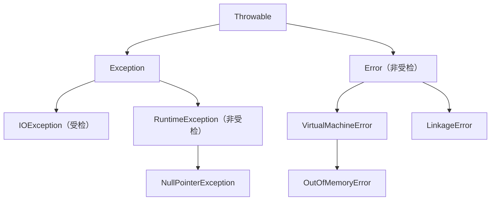

**Throwable 是 Java 中可抛出对象的根类，Exception 和 Error 是它的两个主要分支。** Exception 包含受检异常和非受检的 RuntimeException；Error 及其子类也是非受检的，通常表示应用难以在当前业务操作中恢复的严重问题。

**能捕获，不等于适合捕获后继续执行。** `catch (Exception)` 能接住 Exception 分支，包括 RuntimeException，但接不住 Error；`catch (Throwable)` 能接住两边。处理时应看当前层是否有可靠的恢复办法：有则针对具体异常处理，没有则让失败向上传播。对 Error 通常应定位并修复运行环境或程序问题，不能靠捕获后返回默认结果来宣称操作成功。

## 类型树说明了谁能接住谁

受检与否决定编译器是否要求捕获或声明，不决定运行时能否被 `catch` 匹配，也不能单独决定是否可以恢复。例如 IOException 是受检异常，但磁盘持续故障时重试未必有用；RuntimeException 是非受检异常，入口层仍可以处理明确的参数错误。

## catch 按继承关系匹配，不按严重程度匹配

| 捕获子句 | 能捕获 | 不能捕获 |
| --- | --- | --- |
| `catch (Exception e)` | IOException、RuntimeException 等 Exception 子类 | Error 及其子类 |
| `catch (Error e)` | Error 及其子类 | Exception 及其子类 |
| `catch (Throwable t)` | Throwable 及其所有子类 | — |

例如，`throw new AssertionError()` 不会进入 `catch (Exception e)`，因为 AssertionError 属于 Error 分支。同一继承链上的多个 `catch` 应先写子类型；把 `catch (Throwable)` 放在前面，后面的 Exception 或 Error 分支会因无法到达而编译失败。

## 处理策略取决于是否能承担恢复责任

读取题目文件遇到 IOException 时，知道备选文件的调用方可以改读备选文件；没有备选方案的中间层应传播失败。参数不合法时，入口层可以拒绝请求；如果是内部不变量被破坏，应保留失败并修复程序逻辑。

遇到 OutOfMemoryError、LinkageError 等 Error，业务代码通常没有可信的局部恢复动作。资源耗尽时，连日志记录或构造错误响应都可能失败；链接错误需要排查依赖或类初始化问题。`finally` 或 try-with-resources 可用于正常异常展开时的清理，但不能保证所有严重故障下都能执行。少数框架边界可能为了隔离任务或做最小清理捕获 Throwable，也必须按其明确的失败策略处理，不能吞掉错误并返回正常结果。

Error 不是“编译错误”的统称；它是运行时可抛出的类型分支。

## 参考

- [JLS 17 §11.1.1：异常种类与受检分类](https://docs.oracle.com/javase/specs/jls/se17/html/jls-11.html#jls-11.1.1)。
- [Java 17 Throwable API](https://docs.oracle.com/en/java/javase/17/docs/api/java.base/java/lang/Throwable.html)。
- [Java 17 Error API](https://docs.oracle.com/en/java/javase/17/docs/api/java.base/java/lang/Error.html)。
