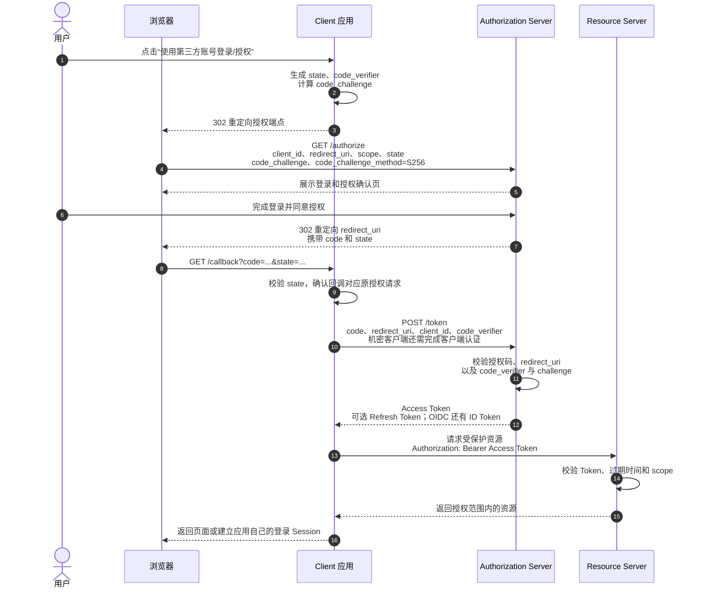

# OAuth 2.0 授权模式与授权码流程

更新时间：2026-07-30

## 核心结论

OAuth 2.0 是一套**授权框架**，它让第三方应用在不获取用户密码的前提下，获得有限、可撤销、有时效的资源访问权限。

例如，用户允许一个学习应用读取其 GitHub 基本资料。应用获得的是有权限范围和有效期的 `Access Token`，而不是用户的 GitHub 密码。

需要先记住三点：

- 有用户参与的 Web、SPA 或移动应用，优先使用**授权码模式 + PKCE**。
- 没有用户参与的服务间调用，通常使用**客户端凭证模式**。
- OAuth 2.0 主要回答“应用可以访问什么”；如果还要回答“当前用户是谁”，通常需要在 OAuth 2.0 之上使用 OpenID Connect（OIDC）。

> 正确拼写是 OAuth 2.0，而不是 OATH 2。

## OAuth 2.0 中的核心角色

| 角色 | 含义 | 典型示例 |
|---|---|---|
| Resource Owner | 资源所有者，通常是用户 | GitHub 账号的拥有者 |
| Client | 申请访问资源的应用 | Web 应用、手机 App、后台服务 |
| Authorization Server | 校验用户并签发 Token 的授权服务器 | GitHub 授权服务器 |
| Resource Server | 保存受保护资源、校验 Access Token 的 API | GitHub API |

授权服务器和资源服务器在逻辑上职责不同，但可以由同一家平台提供，甚至部署在同一个系统中。

## 常见 Token 与中间凭证

| 名称 | 作用 | 关键特点 |
|---|---|---|
| Authorization Code | 用于换取 Token | 一次性、短时效，不能直接调用资源 API |
| Access Token | 访问受保护资源 | 通常短时效，只能在授权范围内使用 |
| Refresh Token | 在 Access Token 过期后申请新 Token | 有效期通常更长，需要更严格保管 |
| ID Token | OIDC 中描述用户身份 | 主要给 Client 识别用户，不应替代 Access Token 调用 API |

`Access Token` 可以是 JWT，也可以只是一个无法解读的随机字符串。OAuth 2.0 并没有规定 Access Token 必须使用 JWT。

## OAuth 2.0 的主要授权模式

OAuth 2.0 中获取 Token 的方式通常称为授权模式（Grant Type）。除最初定义的模式外，还可以通过扩展规范增加新模式，因此不应简单理解为“OAuth 2.0 永远只有四种方式”。

| 授权模式 | 典型场景 | 当前建议 |
|---|---|---|
| 授权码模式（Authorization Code） | Web、SPA、移动 App、第三方登录 | 最常见，推荐配合 PKCE |
| 客户端凭证模式（Client Credentials） | 服务间调用、后台任务 | 常见，仅适用于没有具体用户的场景 |
| 设备授权模式（Device Authorization） | 电视、游戏主机、CLI、IoT | 特定场景常见 |
| 刷新令牌模式（Refresh Token） | Access Token 续期 | 常与授权码模式配合 |
| 隐式模式（Implicit） | 早期浏览器 SPA | 已不推荐，改用授权码 + PKCE |
| 密码模式（Password/ROPC） | 历史遗留的高度信任客户端 | 已不推荐，新系统不应使用 |

### 授权码模式

适用于有用户参与的授权场景。用户在授权服务器上登录和确认授权，Client 先收到一个短时效的授权码，再通过 Token Endpoint 将授权码换成 Access Token。

这种模式将“用户前台授权”和“后台 Token 交换”分成两步，避免在浏览器重定向 URL 中直接传递 Access Token。

### 客户端凭证模式

Client 使用自己的 `client_id` 和客户端认证凭证申请 Access Token，整个过程不需要用户参与。获得的 Token 表示某个应用或服务，不表示某个用户。

### 设备授权模式

输入能力受限的设备先展示验证网址和用户码，用户再使用手机或电脑完成登录和授权。设备按规定间隔查询授权结果，成功后获得 Token。

### 刷新令牌模式

Access Token 过期后，Client 可以使用 Refresh Token 申请新的 Access Token，避免让用户反复登录。实际系统应考虑 Refresh Token Rotation，即刷新成功后同时更换 Refresh Token，并对旧 Token 的重用进行检测。

### 已不推荐的两种模式

隐式模式直接通过浏览器重定向返回 Access Token，Token 更容易出现在 URL、浏览器历史和日志中。现代 SPA 应使用授权码模式 + PKCE。

密码模式要求用户把用户名和密码直接交给 Client，破坏了“客户端不接触用户密码”的安全边界。该模式不应用于新系统。

## 授权码模式的完整数据流转

下图使用现代推荐的“授权码 + PKCE”流程。Client 在发起授权前生成 `code_verifier`，并由它计算 `code_challenge`。



### 第一阶段：发起授权请求

Client 把浏览器重定向授权服务器的 Authorization Endpoint，常见参数包括：

| 参数 | 作用 |
|---|---|
| `response_type=code` | 声明希望获得授权码 |
| `client_id` | 标识申请授权的 Client |
| `redirect_uri` | 授权完成后的回调地址 |
| `scope` | 申请的权限范围 |
| `state` | 绑定授权发起与回调，主要用于防御 CSRF 和授权响应混淆 |
| `code_challenge` | PKCE 挑战值，由 `code_verifier` 计算得到 |
| `code_challenge_method=S256` | 声明使用 SHA-256 计算 PKCE 挑战值 |

`redirect_uri` 必须与 Client 预先登记的地址精确匹配，否则攻击者可能尝试把授权码引流到自己的站点。

### 第二阶段：用户登录并同意授权

用户的账号密码只提交给授权服务器，Client 不应看到这些密码。授权服务器还应向用户展示 Client 正在申请的权限，例如“读取基本资料”或“读取仓库”。

### 第三阶段：返回授权码

用户同意后，授权服务器将浏览器重定向 `redirect_uri`，并在回调中携带：

```text
https://client.example.com/callback?code=SplxlOBeZQQYbYS6WxSbIA&state=af0ifjsldkj
```

Client 必须先校验 `state`。授权码通常只能使用一次，有效期也很短。它只是换取 Token 的中间凭证，不能用来直接调用资源 API。

### 第四阶段：用授权码换取 Token

Client 直接请求授权服务器的 Token Endpoint。这一步不再通过页面跳转，而是 Client 与授权服务器之间的通信。

授权服务器应校验：

- 授权码是否存在、未过期且未被使用。
- 授权码是否签发给当前 `client_id`。
- `redirect_uri` 是否与发起授权时一致。
- `code_verifier` 是否能匹配最初的 `code_challenge`。
- 对于能安全保存凭证的机密客户端，还要校验 Client 身份。

### 第五阶段：使用 Access Token 访问资源

Client 将 Access Token 放在 HTTP `Authorization` 请求头中：

```http
Authorization: Bearer eyJhbGciOi...
```

资源服务器需要校验 Token 的有效性、过期时间、受众和权限范围。例如 Token 只具有 `profile:read` scope，就不应允许用它删除仓库。

## PKCE 解决了什么问题

PKCE（Proof Key for Code Exchange）将授权码与最初发起授权的 Client 实例绑定。核心过程是：

```text
授权前：Client 生成随机 code_verifier
                     ↓ SHA-256 + Base64URL
授权请求：只发送 code_challenge

换 Token 时：Client 发送原始 code_verifier
                     ↓
授权服务器重新计算并与 code_challenge 比较
```

即使攻击者拦截了授权码，没有 `code_verifier` 也无法用它换取 Token。

PKCE 最初主要用于无法安全保存 `client_secret` 的移动 App 和 SPA，现在也建议机密 Web Client 使用。PKCE 不等于 Client 身份认证，不应简单地用 `code_verifier` 取代机密客户端的客户端认证。

## `state` 解决了什么问题

`state` 用于确认授权回调确实对应**当前浏览器之前主动发起的那次授权请求**。它将以下三者关联起来：

```text
发起授权的浏览器 Session
            ↕
本次 OAuth 授权请求
            ↕
授权服务器返回的授权回调
```

`state` 不是浏览器内置的安全机制，而是 OAuth Client 实现的请求关联和 CSRF 防护机制。浏览器只负责携带 URL 中的 `state` 和 Client 域名下的 Session Cookie，真正执行校验的是 Client。

### `state` 在哪个阶段生效

`state` 在发起授权前生成，在授权回调到达 Client 时校验，并且必须在使用授权码换取 Token 之前完成校验。

```text
1. 用户点击登录或授权
2. Client 生成随机 state
3. Client 把 state 保存到当前浏览器的 Session
4. Client 在 /authorize 请求中携带 state
5. 授权服务器完成授权后原样返回 state
6. Client 收到 /callback?code=...&state=...
7. Client 比较回调 state 和 Session 中保存的 state
8. 一致：删除已使用的 state，继续换取 Token
9. 不一致或不存在：立即拒绝回调
```

授权服务器通常不理解 Client 生成的 `state`，只负责在回调中将它原样带回。不能因为授权服务器返回了 `state` 就默认安全，Client 必须将其与当前交易中预先保存的值进行校验。

### 没有 `state` 可能发生什么

以“将 GitHub 账号绑定到学习应用”为例，攻击者可以先用自己的 GitHub 账号发起授权，然后在授权码被使用前截获自己的回调地址：

```text
https://client.example.com/oauth/callback?code=attacker-code
```

攻击者再诱导已经登录学习应用的受害者访问这个地址。如果 Client 不校验 `state`，可能出现以下过程：

```text
受害者点击攻击者构造的链接
        ↓
浏览器访问 Client 的 OAuth 回调接口
        ↓
浏览器自动携带受害者在 Client 中的 Session Cookie
        ↓
Client 使用 attacker-code 换取 Token
        ↓
Token 对应攻击者的 GitHub 账号
        ↓
Client 根据受害者的 Session
把攻击者的 GitHub 绑定到受害者的本地账号
```

攻击者之后可能通过自己的 GitHub 登录到受害者的本地账号。这类攻击通常称为**账号绑定 CSRF**。

在单纯的第三方登录场景中，受害者的浏览器也可能被登录到攻击者的账号。受害者后续输入的个人信息或业务数据，攻击者可以在自己的账号中查看。这类情况通常称为**登录 CSRF**。

### `state` 如何拦截攻击回调

攻击者在自己浏览器中发起授权时，他可以看到自己这次交易的 `state`，但这个值只与攻击者的 Client Session 绑定：

```text
攻击者的 Session.expectedState = state-attacker
攻击者的回调参数 state       = state-attacker
```

当受害者打开这个回调链接时，Client 读取到的是受害者的 Session：

```text
受害者的 Session.expectedState = state-victim
                                  或不存在
攻击链接的回调参数 state = state-attacker
```

比较结果不一致，Client 就会拒绝回调，不使用攻击者的授权码换取 Token。

关键不是“攻击者不知道任何 `state`”，而是：

> 攻击者无法让自己授权响应中的 `state`，与受害者浏览器 Session 中保存的预期 `state` 匹配。

## `state` 与普通 CSRF Token

`state` 和普通 CSRF Token 使用了相同的安全思路：浏览器可以自动携带用户的身份 Cookie，但攻击者无法提供与受害者 Session 匹配的随机值。

### 普通 CSRF 攻击的本质

用户已经登录 `bank.example.com` 后，浏览器保存了银行的 Session Cookie。如果用户访问攻击者网站，攻击者可以诱导用户的浏览器向银行提交请求：

```html
<form action="https://bank.example.com/transfer" method="post">
    <input type="hidden" name="to" value="attacker">
    <input type="hidden" name="amount" value="10000">
</form>

<script>
    document.forms[0].submit();
</script>
```

如果 Cookie 的属性允许，浏览器向银行发送请求时会自动携带银行 Cookie：

```http
POST /transfer HTTP/1.1
Host: bank.example.com
Cookie: SESSION=abc123

to=attacker&amount=10000
```

攻击者不需要知道 `SESSION=abc123` 的具体内容。请求的目标也确实是银行域名，只是这个请求由攻击者页面诱导用户的浏览器发起。

CSRF Token 要求合法请求再携带一个攻击者读取不到、浏览器也不会自动填入的值：

```http
POST /transfer HTTP/1.1
Cookie: SESSION=abc123
X-CSRF-TOKEN: random-7f92a...
```

CSRF Token 不一定要放在 HTTP Header 中，也可以放在合法页面的表单字段中。真正的防护来源不是“使用了 Header”，而是合法请求必须携带攻击者无法构造的随机值。

### `state` 是 OAuth 流程中的一次性 CSRF Token

| 普通 CSRF 防护 | OAuth 授权回调 |
|---|---|
| 浏览器自动携带业务系统的 Session Cookie | 浏览器自动携带 Client 的 Session Cookie |
| 请求携带 CSRF Token | 回调携带 `state` |
| 业务服务器校验 CSRF Token | OAuth Client 校验 `state` |
| 防止伪造转账、修改密码等业务请求 | 防止伪造或注入 OAuth 授权回调 |
| 可能保护多个业务请求 | 通常只保护某一次授权交易 |

二者可以分别概括为：

```text
CSRF Token：
证明这个业务请求来自获得过合法 Token 的客户端。

OAuth state：
证明这个授权回调属于当前浏览器之前发起的授权请求。
```

### CORS 和 SameSite 不能完全替代 CSRF 防护

CORS 主要限制跨源页面读取响应，以及在预检不通过时发送某些复杂请求。但普通 HTML 表单仍然可以向其他域名提交简单请求，因此“攻击者无法读取响应”不等于“攻击请求没有执行”。

`SameSite` 可以减少浏览器在跨站请求中携带 Cookie 的机会。例如，`SameSite=Lax` 通常不会在跨站 POST 中携带 Cookie，但通常会在跨站顶层 GET 导航中携带 Cookie。

OAuth 授权回调通常恰好是从授权服务器跳回 Client 的跨站顶层 GET：

```text
accounts.example.com
        ↓ 302 Redirect
client.example.com/oauth/callback?code=...&state=...
```

浏览器在这种场景中可能仍然携带 Client 的 `SameSite=Lax` Session Cookie。这是 OAuth 授权流程能够恢复原浏览器 Session 的基础，也意味着 OAuth Client 不能只依赖 `SameSite=Lax` 防御登录 CSRF，仍然需要校验 `state`。

### `state` 的实现要求

- 使用密码学安全的随机数生成，具有足够熵，不能使用固定值、可预测序号或单独的时间戳。
- 将其与发起授权的浏览器 Session 和具体授权交易绑定。
- 在 OAuth 回调中先校验 `state`，再使用授权码换取 Token。
- 校验成功后立即删除或标记为已使用，防止同一个 `state` 被重放。
- 设置较短的过期时间，过期、缺失或不匹配时拒绝授权回调。
- 不在未保护的 `state` 中直接放入敏感信息，因为它会经过 URL 和浏览器重定向。

`state` 有时还会关联登录成功后的页面跳转位置。更稳妥的做法是使用随机 `state` 作为服务端授权交易数据的索引，并对可跳转地址使用允许列表，避免引入开放重定向漏洞。

## `state`、PKCE 和 `nonce` 的区别

| 机制 | 主要防护目标 | 在哪里使用 |
|---|---|---|
| `state` | 绑定授权请求和回调，防御 CSRF 和响应混淆 | OAuth 2.0 授权请求与回调 |
| PKCE | 防止被拦截的授权码被其他人换成 Token | 授权请求与 Token 交换 |
| `nonce` | 将 OIDC 认证请求与 ID Token 绑定，减少重放和 Token 注入风险 | OIDC 请求与 ID Token |

三者的职责不同，不是互相替代的关系。

## Web、SPA 和移动 App 中的差异

### 有后端的 Web 应用

后端可以作为机密 Client，在服务端保存客户端凭证、接收授权回调并换取 Token。完成第三方身份认证后，应用还可以建立自己的 Session，浏览器后续只持有 HttpOnly Session Cookie，而不直接持有第三方 Token。

### SPA

SPA 中的 JavaScript 无法安全保存长期有效的 `client_secret`，因此它属于公开 Client，应使用授权码 + PKCE。对安全要求较高的应用，可以使用 BFF（Backend for Frontend）把 Token 保留在服务端。

### 移动 App

移动 App 同样不能把内置的 `client_secret` 当作真正秘密，因为安装包可以被提取和分析。它应使用系统浏览器发起授权，并使用授权码 + PKCE，而不是在 App 内部收集第三方账号密码。

## OAuth 2.0 与 OIDC 的关系

OAuth 2.0 主要是授权协议，Access Token 表示 Client 获得了某些资源访问权限。仅拿到 Access Token 不等于 Client 已经按标准方式完成了用户身份认证。

OIDC 在 OAuth 2.0 上增加了身份层，其关键产物是 `ID Token`。实际中的“使用 Google 登录”通常是：

```text
OAuth 2.0 授权码流程
        +
OIDC 的 openid scope、ID Token、UserInfo 等身份能力
```

Client 应校验 ID Token 的签名、签发者（`iss`）、受众（`aud`）、过期时间（`exp`）和 `nonce` 等数据，不能只是对 JWT 做 Base64 解码后就信任其内容。

## 常见误区

### 误区一：OAuth 2.0 就是登录协议

OAuth 2.0 的核心目标是授权。需要标准化用户身份认证时，应使用 OIDC，不要自行把任意 OAuth Access Token 解释为登录身份。

### 误区二：授权码就是 Access Token

授权码是一次性中间凭证，用于在 Token Endpoint 换取 Token；Access Token 才是资源服务器接受的 API 访问凭证。

### 误区三：有了 PKCE 就不需要 `state`

PKCE 主要防止授权码被拦截后盗用，`state` 主要绑定授权请求和回调。两者解决的问题不同。

### 误区四：`state` 是浏览器自动校验的

浏览器只负责在页面跳转中传递 `state` 并按 Cookie 规则携带 Client Session。是 Client 从当前 Session 中取出预期值，并与回调参数进行校验。

### 误区五：SPA 中只要把 `client_secret` 写得隐蔽就安全

发布给浏览器的代码和字符串都可以被用户查看，因此 SPA 不存在可靠的客户端秘密。不应把 `client_secret` 打包到前端产物中。

### 误区六：Access Token 一定是 JWT

OAuth 2.0 允许不同的 Token 形式。资源服务器可以本地验证 JWT，也可以通过 Token Introspection 向授权服务器查询不透明 Token 的状态。

## 面试表达

可以用下面这段话概括 OAuth 2.0 和授权码模式：

> OAuth 2.0 是一套授权框架，让 Client 在不接触用户密码的情况下，通过 Access Token 访问用户授权的资源。现在最常用的是授权码模式 + PKCE：用户在授权服务器完成登录和授权，授权服务器通过浏览器回传一次性授权码，Client 再通过 Token Endpoint 用授权码和 `code_verifier` 换取 Access Token。`state` 用于绑定请求和回调，PKCE 用于防止被拦截的授权码被盗用。如果场景是第三方登录，通常还会在 OAuth 2.0 上使用 OIDC 确认用户身份。

## 可继续深入的方向

- OAuth 2.1 相对 OAuth 2.0 的安全收敛。
- OIDC 的 ID Token、UserInfo Endpoint、Discovery 和 JWKS。
- JWT 校验、不透明 Token 与 Token Introspection。
- Refresh Token Rotation、Token 撤销与会话退出。
- SPA 直接持有 Token 与 BFF 架构的安全取舍。
- Spring Security OAuth2 Client 中的授权请求、回调和会话建立过程。
